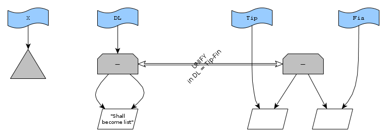
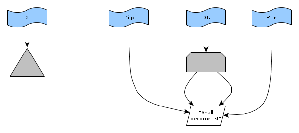

# The Difference List

- ["Difference List" wiki entry](https://swi-prolog.discourse.group/t/difference-list/959) at Prolog Discourse site.
- ["Difference Lists" by Frank Pfenning](https://www.cs.cmu.edu/~fp/courses/lp/lectures/11-diff.pdf) (PDF)
- [Applying "Difference Lists" to DCGs by Markus Triska](https://www.metalevel.at/prolog/dcg). "Difference Lists" are called "List Differences" here: _In the literature, you will also encounter the term "difference list". However, this terminology is misleading: We are not talking about—as the name may suggest—a special kind of list. The additional arguments are completely ordinary lists. It is their differences that matter especially in such cases._
- [Presentation on Difference Lists](https://www.cl.cam.ac.uk/teaching/0809/Prolog/Prolog08ML5R2.pdf) by David Eyers at University of Cambridge, for the [Prolog Course](https://www.cl.cam.ac.uk/teaching/0809/Prolog/).

"Difflist as a queue" is actually very illustrative of the "list difference" idea:

- Items are appended at the front of the tail, the variable of the tail "wanders rightwards"
- Items are dropped off the front of the head, the variable of the head "wanders rightwards"
- What is actually in the difflist is alwasy the list difference ... what is between tail var and head var.      

## Naming and Graphing

First take a look at this page, which defines the symbols and the vocabulary used below: [Naming and Symbols](../naming_and_symbols/README.md)

## Appending to a Difference List

In Prolog, it is cheap to prepend an item to a list (also called "pushing an item onto a list" if it is regarded
as a stack.  

However, in order to append efficiently, you need the difference list pattern. It is a "pattern" because
there is real data structure corresponding to a "difference list". Just a set of conventions.

Consider this program, which exercises the difference list pattern, in short form and extensive form complete with
debugging output:

### (Very) Short Form

```Logtalk
dl_do(Data,Result) :- 
   dl_append_all(Data,Result-Result).

dl_append_all([X|Xs],DL) :- 
   dl_append(X,DL,DLlonger),
   dl_append_all(Xs,DLlonger).
   
% close the difflist

dl_append_all([],_-[]). 

% append a single item to the difflist

dl_append(X,Tip-[X|NewFin],Tip-NewFin). 

% ===
% Tests
% ===

:- begin_tests(difflist).

test(one, true(R=[1,2,3])) :- dl_do([1,2,3],R).
test(two, true(R=[]))      :- dl_do([],R).
   
:- end_tests(difflist).

rt :- run_tests(difflist).
```

### Extensive Form, with Debug Output

It is so extensive that is is better in a separate file: [dl.pl](dl.pl).

Running it gives the following output. The integer shows the recursion depth (alternatively, the 
index of the input list item that is being currently copied). Note that the `dl_append` operation
destroy the "difflist" character of the term referenced by `DL` in the current stack frame.
The result of the appends is found in the _Tip_ of the closed difflist.

``` 
?- debug(dl),run_tests(difflist).
% PL-Unit: difflist 
% 0: DL before dl_append: Empty difflist: ∅
% 0: DL after dl_append: Unknown stuff: [1|_2716]-[1|_2716]
% 1: DL before dl_append: Nonempty difflist: [1|∅]
% 1: DL after dl_append: Unknown stuff: [1,2|_3096]-[2|_3096]
% 2: DL before dl_append: Nonempty difflist: [1,2|∅]
% 2: DL after dl_append: Unknown stuff: [1,2,3|_3518]-[3|_3518]
% 3: DL before closing: Nonempty difflist: [1,2,3|∅]
% 3: DL after closing: Closed difflist: [1,2,3]-[]
% 2: DL after dl_append_all: Closed difflist: [1,2,3]-[3]
% 1: DL after dl_append_all: Closed difflist: [1,2,3]-[2,3]
% 0: DL after dl_append_all: Closed difflist: [1,2,3]-[1,2,3]
.
% 0: DL before closing: Empty difflist: ∅
% 0: DL after closing: Closed difflist: []-[]
. done
% All 2 tests passed
true.
``` 

## Graphing the data structure

**THIS IS STILL CRAP**

### Construct initial difference list in `do/2`

```
DL = F-F
```


Results in


### Append first item inside `append_to_difflist/3`

```
DLin = H-T
```



Results in


```
T=[Item|NewT]
```



Results in


After unification, the unconstrained-tail-list rooted at `H` has become longer by `Item`
(in effect, the list has been constrained some more -- you have uncovered new info
about the list -- ... but it still has an unconstrained tail).

```
DLout=H-NewT
```

Construct new difflist according to our `H-T` convention.
`DLout` combines the unconstrained-tail-list rooted at `H` and the new unconstrained tail `NewT`.


-------------

### Append second item inside `append_to_difflist/3`

Just about to unify `T` and `[Item|NewT]`.


After unification, the unconstrained-tail-list rooted at `H` has become longer by `Item` (in effect, the list has been constrained
some more ... but it still has an unconstrained tail).


Construct new difflist according to our `H-T` convention.
`DLout` combines the unconstrained-tail-list rooted at `H` and the new unconstrained tail `NewT`.


### Redux: Append third item inside `append_to_difflist/3`

Just about to unify `T` and `[Item|NewT]`.


After unification, the unconstrained-tail-list rooted at `H` has become longer by `Item` (in effect, the list has been constrained
some more ... but it still has an unconstrained tail).


Construct new difflist according to our `H-T` convention.
`DLout` combines the unconstrained-tail-list rooted at `H` and the new unconstrained tail `NewT`.


### Close the difflist inside `close_difflist/2`

To close the list and create a "real list", unify the "ion" with `[]`.


This leaves us with a "real list", correctly terminated and all.


Finally get rid of the first dummy element by deconstructing the list reachable by `H`.


This leaves us just with the correctly constructed list in `Result`, which is what we want.


