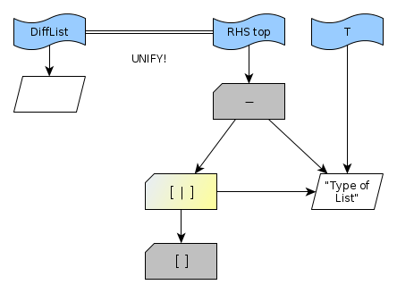

# The Difference List

- ["Difference List" wiki entry](https://swi-prolog.discourse.group/t/difference-list/959) at Prolog Discourse site.
- ["Difference Lists" by Frank Pfenning](https://www.cs.cmu.edu/~fp/courses/lp/lectures/11-diff.pdf) (PDF)
- [Applying "Difference Lists" to DCGs by Markus Triska](https://www.metalevel.at/prolog/dcg). "Difference Lists" are called "List Differences" here: _In the literature, you will also encounter the term "difference list". However, this terminology is misleading: We are not talking about—as the name may suggest—a special kind of list. The additional arguments are completely ordinary lists. It is their differences that matter especially in such cases._

## Constructing a list by appending to it via a Difference List

In Prolog, it is always cheap to prepend an item to a list (also called "pushing an item onto a list" if it is regarded
as a stack.  

However, in order to append efficiently, you need the difference list.

(For Perl aficionados, the corresponding verb is "unshift (an item)" because "pop" and "push" happen at Perl (array and list) ends, 
while "shift" and "unshift" happen at the front).


do :- 
   Data = [1,2,3,4],         % Arbitrary data to be appended.
   DiffList = [[]|T]-T,      % Construct initial difflist, 
                             % with an arbitrary first item []
                             % and arbitrarily represented by a single term
                             % (one could use two terms instead)


### Construct initial difference list

```
DiffList = [[]|T]-T
```



Resulting variable binding


