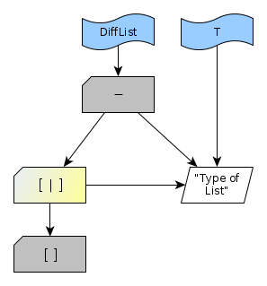
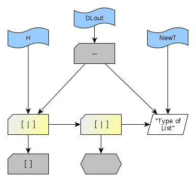
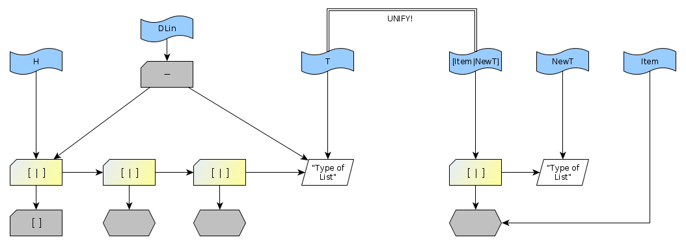
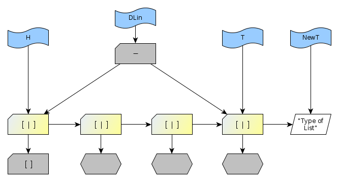
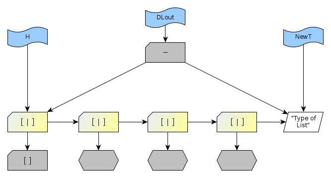
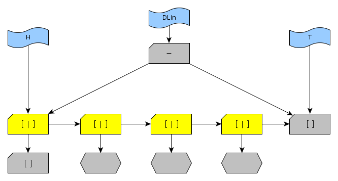
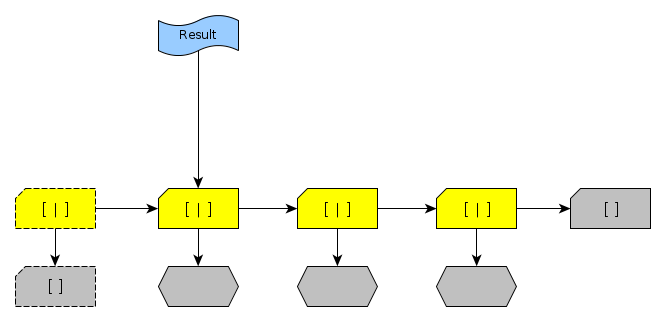

# The Difference List

- ["Difference List" wiki entry](https://swi-prolog.discourse.group/t/difference-list/959) at Prolog Discourse site.
- ["Difference Lists" by Frank Pfenning](https://www.cs.cmu.edu/~fp/courses/lp/lectures/11-diff.pdf) (PDF)
- [Applying "Difference Lists" to DCGs by Markus Triska](https://www.metalevel.at/prolog/dcg). "Difference Lists" are called "List Differences" here: _In the literature, you will also encounter the term "difference list". However, this terminology is misleading: We are not talking about—as the name may suggest—a special kind of list. The additional arguments are completely ordinary lists. It is their differences that matter especially in such cases._
- [Presentation on Difference Lists](https://www.cl.cam.ac.uk/teaching/0809/Prolog/Prolog08ML5R2.pdf) by David Eyers at University of Cambridge, for the [Prolog Course](https://www.cl.cam.ac.uk/teaching/0809/Prolog/).

"Difflist as a queue" is actually very illustrative of the "list difference" idea:

- Items are appended at the front of the tail, the variable of the tail "wanders rightwards"
- Items are dropped off the front of the head, the variable of the head "wanders rightwards"
- What is actually in the difflist is alwasy the list difference ... what is between tail var and head var.      

## Naming

What do you call the "front part" (the part that can be reached from the "head variable")
and the "back part" (the part that can be reached from the "tail variable") of a "list difference"?

- Head and Tail? (a bit confusing because Head also means "the first element of a list" and Tail "everything but the first element")
- Front and back? (maybe)
- Chain and Ion? (I like this, the difflist is like a free radical with an ion at the end)

How do you call the variables?

- headvar and tailvar?

In all explanations, there is a smearing between the concepts of the "variable name" and "what the variable refers to". How to make this clear?

What's *action* called?

- If a difflist is regarded as a queue ... append/remove?
- And "close" to create the real list?
- Push and Pop are often used at the front of a list, so do not seem appropriate.
- In Perl, there is "shift and unshift" and "pop and push". But the shift/unshift happens at the front of an array, whereas the "pop and push" happens at the back.

## Special cases

- The empty difflist, same as the initial difflist. Both head and tail variables name the same fresh variable.

## Constructing a list by appending to it via a Difference List

In Prolog, it is cheap to prepend an item to a list (also called "pushing an item onto a list" if it is regarded
as a stack.  

However, in order to append efficiently, you need the difference list.

Consider this program, in which the unifications have been made more explicit than is usually the case in Prolog:

```logtalk
do(Data,Result) :- 
   DiffList = F-F,                    % Construct initial difflist where headvar H and tailvar T
                                      % designate the same fresh variable F.                
                                      % - Arbitrarily represented by a single term H-T.
                                      % - One could use two terms (and separate args) instead.
   append_all(Data,DiffList,Result).  % Let's go!

% ---
% Recurse over input list, appending to difflist
% ---

append_all([],DLin,Result) :-
   close_difflist(DLin,Result).

append_all([Item|Items],DLin,Result) :-
   append_to_difflist(Item,DLin,DLmed),
   append_all(Items,DLmed,Result).

% ---
% Close the difflist
% ---

close_difflist(DLin,Result) :-        
   DLin=H-T,                          % Destructure difflist term.
   T=[],                              % This "closes" the difflist and creates a real list.
   Result=H.                          % Done!

% ---
% Append an item to the difflist
% ---

append_to_difflist(Item,DLin,DLout) :-
   DLin=H-T,                          % Destructure difflist term.
   T=[Item|NewT],                     % Constrain the tail to a new unconstrained tail with one more item.
   DLout=H-NewT.                      % Construct a new difflist using our H-T convention.

% Test this!

:- begin_tests(do).
test(a) :- do([1,2,3],R), R=[1,2,3].
:- end_tests(do).

rt :- run_tests(do).
```

We can graphically illustrate what happens. We just need the following concepts, which are also useful in explaining anything else Prolog does:


### Construct initial difference list in `do/2`

ATTENTION: The images below illustrate the previous version of the above program, which used a dummy list entry at construction time, which is not necessary at all! To be fixed.

```
DiffList = [[]|T]-T
```

There is also something missing to handle sharing variables. 


Resulting variable binding



### Append first item inside `append_to_difflist/3`

Just about to unify `T` and `[Item|NewT]`.


After unification, the unconstrained-tail-list rooted at `H` has become longer by `Item` (in effect, the list has been constrained
some more -- you have uncovered new info about the list -- ... but it still has an unconstrained tail).


Construct new difflist according to our `H-T` convention.
`DLout` combines the unconstrained-tail-list rooted at `H` and the new unconstrained tail `NewT`.



### Append second item inside `append_to_difflist/3`

Just about to unify `T` and `[Item|NewT]`.


After unification, the unconstrained-tail-list rooted at `H` has become longer by `Item` (in effect, the list has been constrained
some more ... but it still has an unconstrained tail).


Construct new difflist according to our `H-T` convention.
`DLout` combines the unconstrained-tail-list rooted at `H` and the new unconstrained tail `NewT`.


### Redux: Append third item inside `append_to_difflist/3`

Just about to unify `T` and `[Item|NewT]`.



After unification, the unconstrained-tail-list rooted at `H` has become longer by `Item` (in effect, the list has been constrained
some more ... but it still has an unconstrained tail).



Construct new difflist according to our `H-T` convention.
`DLout` combines the unconstrained-tail-list rooted at `H` and the new unconstrained tail `NewT`.



### Close the difflist inside `close_difflist/2`

To close the list and create a "real list", unify the "ion" with `[]`.


This leaves us with a "real list", correctly terminated and all.



Finally get rid of the first dummy element by deconstructing the list reachable by `H`.


This leaves us just with the correctly constructed list in `Result`, which is what we want.




