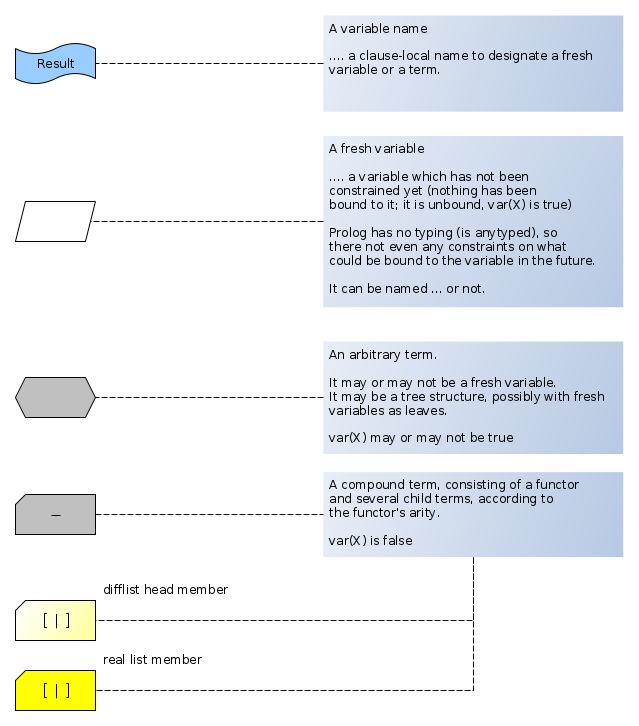
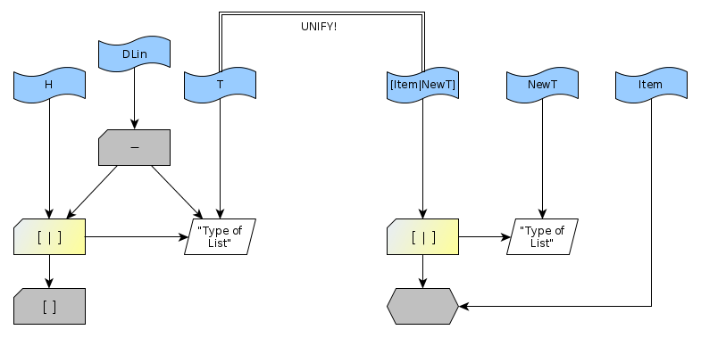
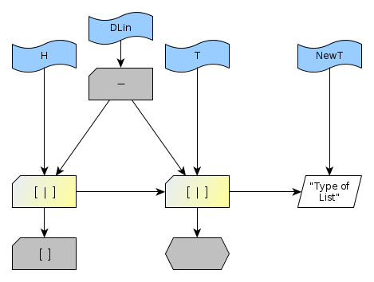
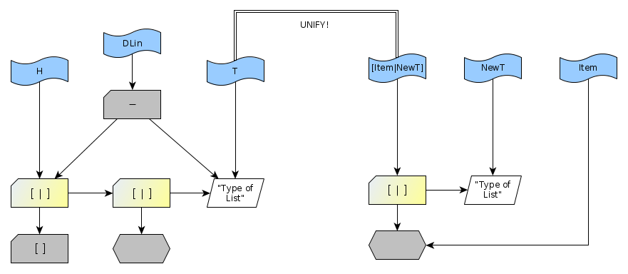
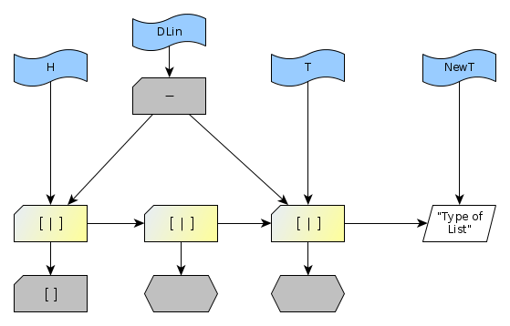
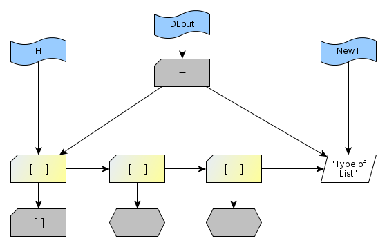

# The Difference List

- ["Difference List" wiki entry](https://swi-prolog.discourse.group/t/difference-list/959) at Prolog Discourse site.
- ["Difference Lists" by Frank Pfenning](https://www.cs.cmu.edu/~fp/courses/lp/lectures/11-diff.pdf) (PDF)
- [Applying "Difference Lists" to DCGs by Markus Triska](https://www.metalevel.at/prolog/dcg). "Difference Lists" are called "List Differences" here: _In the literature, you will also encounter the term "difference list". However, this terminology is misleading: We are not talking about—as the name may suggest—a special kind of list. The additional arguments are completely ordinary lists. It is their differences that matter especially in such cases._

## Naming

What do you call the "front part" (the part that can be reached from the "head variable")
and the "back part" (the part that can be reached from the "tail variable") of a "list difference"?

- Head and Tail? (a bit confusing because Head also means "the first element of a list" and Tail "everything but the first element")
- Front and back? (maybe)
- Chain and Ion? (I like this, the difflist is like a free radical with an ion at the end)

## Constructing a list by appending to it via a Difference List

In Prolog, it is always cheap to prepend an item to a list (also called "pushing an item onto a list" if it is regarded
as a stack.  

However, in order to append efficiently, you need the difference list.

(For Perl aficionados, the corresponding verb is "unshift (an item)" because "pop" and "push" happen at Perl (array and list) ends, 
while "shift" and "unshift" happen at the front).

Consider this program, in which the unifications have been made more explicit than is usually the case in Prolog:

```logtalk
do(Data,Result) :- 
   DiffList = [[]|T]-T,               % Construct initial difflist, 
                                      % with an arbitrary first dummy item, here []
                                      % and arbitrarily represented by a single term H-T
                                      % (one could use two terms (separate args) instead).
   append_all(Data,DiffList,Result).  % Let's go!

% ---
% Recurse over input list, appending to difflist
% ---

append_all([],DLin,Result) :-
   close_difflist(DLin,Result).

append_all([Item|Items],DLin,Result) :-
   append_to_difflist(Item,DLin,DLmed),
   append_all(Items,DLmed,Result).

% ---
% Close the difflist
% ---

close_difflist(DLin,Result) :-        
   DLin=H-T,                          % Destructure difflist term.
   T=[],                              % This "closes" the difflist and creates a real list.
   H=[_|Result].                      % Destructure the now real list, dropping the first dummy item.

% ---
% Append an item to the difflist
% ---

append_to_difflist(Item,DLin,DLout) :-
   DLin=H-T,                          % Destructure difflist term.
   T=[Item|NewT],                     % Constrain the tail to a new unconstrained tail with one more item.
   DLout=H-NewT.                      % Construct a new difflist using our H-T convention.

% Test this!

:- begin_tests(do).
test(a) :- do([1,2,3],R), R=[1,2,3].
:- end_tests(do).

rt :- run_tests(do).
```

We can graphically illustrate what happens. We just need the following concepts, which are also useful in explaining anything else Prolog does:



### Construct initial difference list in `do/2`

```
DiffList = [[]|T]-T
```


Resulting variable binding


### Append first item inside `append_to_difflist/3`

Just about to unify `T` and `[Item|NewT]`.



After unification, the unconstrained-tail-list rooted at `H` has become longer by `Item` (in effect, the list has been constrained
some more -- you have uncovered new info about the list -- ... but it still has an unconstrained tail).



Construct new difflist according to our `H-T` convention.
`DLout` combines the unconstrained-tail-list rooted at `H` and the new unconstrained tail `NewT`.


### Append second item inside `append_to_difflist/3`

Just about to unify `T` and `[Item|NewT]`.



After unification, the unconstrained-tail-list rooted at `H` has become longer by `Item` (in effect, the list has been constrained
some more ... but it still has an unconstrained tail).



Construct new difflist according to our `H-T` convention.
`DLout` combines the unconstrained-tail-list rooted at `H` and the new unconstrained tail `NewT`.



### Redux: Append third item inside `append_to_difflist/3`

Just about to unify `T` and `[Item|NewT]`.


After unification, the unconstrained-tail-list rooted at `H` has become longer by `Item` (in effect, the list has been constrained
some more ... but it still has an unconstrained tail).


Construct new difflist according to our `H-T` convention.
`DLout` combines the unconstrained-tail-list rooted at `H` and the new unconstrained tail `NewT`.


### Close the difflist inside `close_difflist/2`


