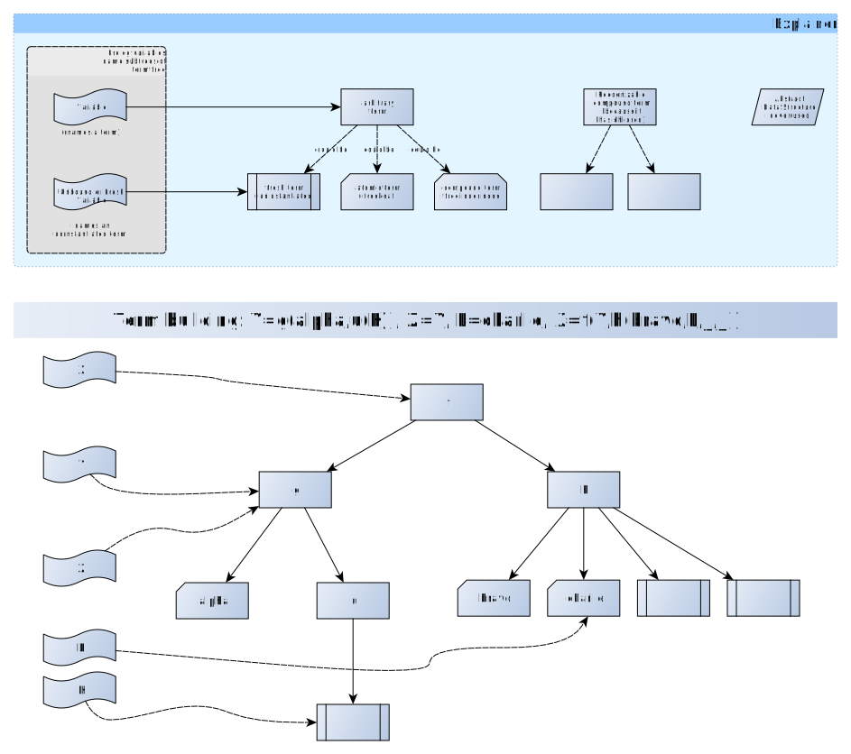
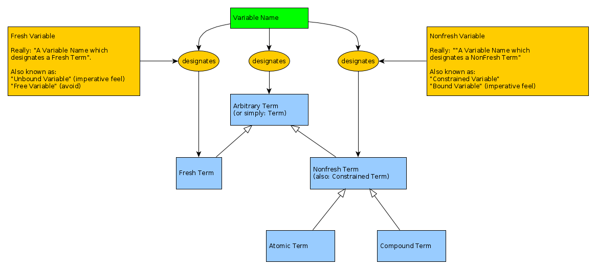
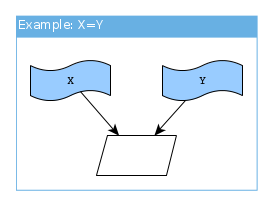
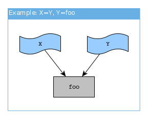
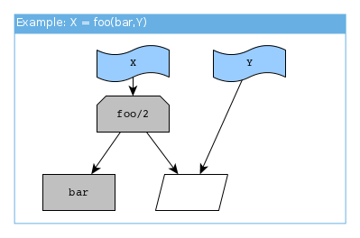
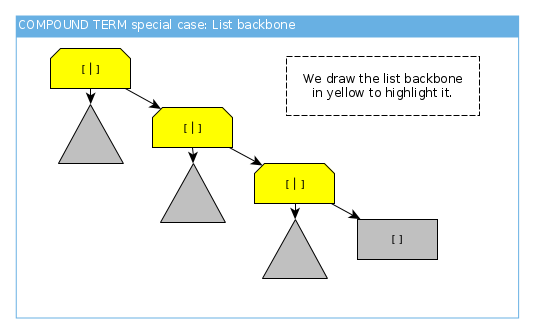
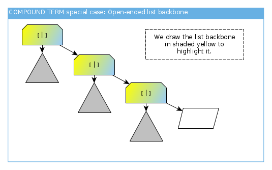

# Needs some review

Graphical notation can still be simplifed. TO BE DONE!



# Names and Symbols

Trying to depict & name the Prolog structures.

To clarify the concepts, I will introduce the following vocabulary and assorted symbols for a pictorial representation. This vocabulary is maybe a bit shifted relative to what is used "normally" (but not all that much), but what is used "normally" is sometimes confusing and may hinder clearly expressing what is going on.

We start with the

## Overview

We have these "kind of things":

- A shallow subclassing tree for the concept of _Term_ in blue;
- The _Variable Name_ concept in green;
- A relationship whereby the _Variable Name_ is connected to certain _Terms_. This is used to explain
  the concepts of a _Fresh Variable_ or a _Nonfresh Variable_.



## Concepts

### "Variable Name"

A _Variable Name_ is an indirect reference to a _Term_ (i.e. a "name" or a "stand-in"; you are supposed to use a
dictionary to find the corresponding _Term_). A _Variable Name_ appears in clauses or at the Prolog Toplevel.

A _Variable Name_ is represented by a syntactic element that stars with an uppercase latter: `X`.

When the discussed meaning shifts towards the relationship between the _Variable Name_ and the _Term_ it references,
one starts to use the words _Variable_ or _Logical Variable_, and the adjective-adorned expressions
_Fresh Variable_ and _Nonfresh Variable_.

A _Variable Name_ is always clause-local, and the _Term_ it references is always program-global.

### "Fresh Variable"

The relationship between a _Variable Name_ and a _Term_ is called a _Fresh Variable_ when the designated term is 
a _Fresh Term_. One also talks about an _Unbound Variable_ (gives an imperative programming feel though.)

[`var(X)`](https://eu.swi-prolog.org/pldoc/doc_for?object=var/1) (where `X` is the syntactic element that 
represents the _Variable Name_) yields `true`. 

Note `var(X)` should really be called `fresh(X)`, because it is not asking whether `X` is a variable (we know that)
but whether this is a _Fresh Variable_. Asking `var(x)` is pointless and should be flagged by the compiler.

A _Fresh Variable_ is sometimes called a _free variable_. This is confusing, as a _free variable_ is a 
variable appearing a formula which is only known to _not be local_ (e.g. not scope-restricted by a lambda prefix).
It may be fresh or not. We will avoid the description _free variable_ except in the appropriate context (e.g. when
discussion [`bagof/3`](https://eu.swi-prolog.org/pldoc/doc_for?object=bagof/3)).

### "Nonfresh Variable"

The relationship between a _Variable Name_ and a _Term_ is called a _Nonfresh Variable_ when the designated term is 
a _Nonfresh Term_. One also talks about a _Constrained Variable_ (my preferred description), a _Bound Variable_ 
(gives an imperative programming feel)

[`nonvar(X)`]8https://www.swi-prolog.org/pldoc/doc_for?object=nonvar/1) yields `true`. 
Again, `nonvar(X)` should really be `nonfresh(X)`.

### "Fresh Term"

A _Fresh Term_ is a term that is as yet unconstrained but can be "refined" or "further constrained" as
computation proceeds, to be replaced by a _Term_ that is _Not Fresh_, which we call a _Nonfresh Term_ or
_Constrained Term_.

A _Fresh Term_ expresses that "we know nothing about the form that the _Term_ should take on ... yet"

A _Fresh Term_ may or may not be named through a _Variable Name_.

Note that Prolog does not allow to express constraints on _Fresh Terms_, which is a pity.
In fact, such constraints have to be 
emulated by making the _Term_ a _Compound Term_ (very _Nonfresh_) and putting the _Fresh Term_ about which 
constraints have to be expressed somewhere into the _Compound Term_; this misses the point a bit and feels like working
in assembly language. Metainterpreters can help here.

### "Term"

A _Term_ is some structure managed by the Prolog Processor. The following classes can be distinguished, where
the _Fresh Term_ is a special case:

- _Atomic Term_: A _Term_ that is constrained to be some "atomic" value, which is a value without examinable
  inner structure. Example: The `integer` represented by `123`, The `atom` represented by `helloworld`. In SWI-Prolog,
  includes the empty list represented by `[]`.
- _Compound Term_: A _Term_ that is itself a tree of _Term_. It is certainly not a _Fresh Term_, but may
   contain _Fresh Terms_ as tree leaves. Actually one can construct _Compound Terms_ that are not trees but 
   directed acyclic graphs or that have cycles. It is generally best to avoid generating such nontree structures.
- _Fresh Term_: As described above.
- _Nonfresh Term_, also known as a _Constrained Term_. It is a _Term_ about which we know something rather than nothing.
   Takes the form of an _Atomic Term_ or a _Compound Term_.
- _Arbitrary Term_: any of the above.

### More on the "Compound Terms"

Every _Compound Term_ tree that is not a _Fresh Term_ leaf has a name, the "functor" (an atom) and N>=0
child nodes, where N is the arity of the node. You thus can have compound term of 0 arity (which are however not
atomic ... I think!)

If we are talking about the _Compound Term_ at the root of the tree, we say "the root compound term" 
and inscribe the functor/arity into the symbol.

Special case: the functor '[|]' with arity 2 is the root compound term of the list backbones (the list backbone
must however, be well-formed, i.e. terminate in the empty list eventually; a list is a non-local structure constraint!)
In Prologs other than SWI-Prolog the list backbone root compound term is the traditional `.`.

## More on "Difference Lists"

See also: [difflists](../difflists/README.md).

The basis of a _List Difference_ or _Difference List_ or _Difflist_ is a list-like structure where the 
backbone _Fin_ does not reference a `[]` "to its left" but rather a fresh term. We call this structure 
an _Unterminated List_ or an _Open List_. Transforming an _Open List_ into a _Closed List_ by constraining the
final fresh term to `[]` (or to any other closed list of length L >= 0) is called _Closing the List_. The structure,
now properly terminated in `[]`, it is a real list, alternatively called a _Closed List_. 

The difference list is generally represented by a pair of variables `A-B` where `A` references the backbone _Tip_ and
`B` references the fresh variable one past the backbone _Fin_ (and thus, `B` it is a fresh variable referencing the
fresh term in which the list backbone ends). Both `A` , as a special kind of _Backbone Tip_ and `B` need special
names: let's use _Open Tip_ and _Open Fin_.

A special case is the empty difference list, which consists of a single fresh term, named alike by the _Open Tip_
and the _Open Fin_ as `F-F = OTip-OFin`. Note that `OTip` references what would be the empty list if this were
a closed list. It is definitely not a "normal _Tip_".

## Diagrams

We can now define a specific symbol for each concept. We also relax the vocabulary a bit now. 


Example of a fresh term that has two names (which "are" thus both fresh variables). This occurs after executing

```
?- X=Y.
```



Example after the fresh term has been bound to an atomic term. This occurs after executing for example

```
?- X=Y, Y=foo.
```

Note that there is no way to perform an "unbind". The fresh term will be reinstated only when backtracking occurs.



Example of a compound term tree. This is build by running

```
?- X=foo(bar,Y).
```



Example of a list backbone, having arbitrary terms as list items, and the empty list atom terminating the list:
A _Closed List_. Note that this is a tree structure.



Example of a list backbone that is "open-ended" as used in the "difference list" pattern. A fresh term is
terminating the list. This is a _Open List_ and it is generally written paired with `-` with a fresh variable
referencing the fresh term:  `[a,b,c,d|U]-U`. One can regard this as representing "the set of lists with the given 
prefix". 



By construction, and asymmetrically, Prolog does not allow one to specify a list that is "open on its front",
one can only say is that there might be _N_ unknown items, where each item is represented by a fresh term, and
_N_ is known: `[U0,U1,U2,a,b,c,d]`.

## More Vocabulary

Now we still need a convention for naming parts of a list, be it a real list or an open-ended list.

A list can take on a number of roles, and these roles can change instruction by instruction:

- Lists as lists: Just an ordered sequence of terms.
- Lists as arrays: A mapping of a monotonically increasing integer sequence to a term.
- Lists as sets: The list may not contain two indistinguishable (by some predicate) terms ("the same term")
- Lists as ordsets: In addition to being a set, there is an ordering relationship (often used for efficiency). See `library(ordsets)`.
- Lists as bags: The list may contain arbitrary terms, with arbitrary repetition.
- Lists as ordbags: In addition to being a bag, there is an ordering relationship (I have have never encoutered this, but it's a self-evident idea)
- Lists as stacks. On "pops" the first list item to remove it, or pushes a new list item "on top of" the first item (In Perl, this is called "shift" and "unshift").
- Lists as queues. One "removes" the last list item to remove it, or appends a new list item after the last item item (In Perl, this is called "pop" and "push" - the stack's front is at the end of a list (really, an array)).
- Lists as maps: Arbitrary Key-Value mappings are realized by storing Key-Value pairs in a list, generally joined into a compound term with the functor `-`. Thus, every item is a `-(K,V)` or more elegantly written, a `K-V`.

**Structure aliasing**

Prolog allows to specify a pattern for term structure. This is always unification, whereby variables, 
whether fresh or nonfresh, are bound to terms or subterms of terms, or terms are assembled from other terms:

```
% Unification means "make sure the LHS and RHS have the same structure / are the same term",
% but it can be regarded variously

X=1,Y=2,Z=[X,Y].  % Unification works as "assembly/aliasing": Assemble a list from two nonfresh variables
Z=[X,Y].          % Unification works as "assembly/aliasing": Assemble a list from two fresh variables
[1,2]=[X,Y].      % Unification works as "dis-assembly": Bind X to 1, Y to 2
                  % This is also called "destructuring" in languages that pattern match (Erlang, Clojure)
[1,Y]=[X,2].      % Unification works as "exchange": Bind X to 1, Y to 2
```

In fact, the LHS is mapped to the structure of the term on the RHS, and the RHS is mapped to the structure of the LHS.

In the above, there is a slight feel of after/before but this becomes more evident when considering calls:

Assembly before calling p or disassembly when Z is really a "returned value".

```
before(_).
after(_).
p(Z) :- ...

?- before([H|T]),p([H|T]),after([H|T]),
```

Disassembly when calling q or assembly when [H|T] is really a "returned value".

```
before(_).
after(_).
q([H|T]) :- ...

?- before(Z),p(Z),after(Z),
```

It really depends on whether the information content of the argument of `before/1` and `after/1` increases or
remains constant as computation progress (ah, an objective criterium).

The word *alias* sounds pretty good. 

**What the list contains**

_List Items_ or _List Elements_, also _List Members_.

**List sides**

_Front_ vs. _Back_: A list is inherently asymmetric. It has a _Front_ side, with the _Tip_ the first element, and
a _Back_ side, with the _End_ (or _Fin_) the last element.

The _Tip_ is the `car(L)` in traditional LISP.

```
Front  [I0,I1,I2,I3,......,I(-3),I(-2),I(-1)]  Back
        ^                                 ^
        |__Tip (First Item)               |__Fin/End (Last Item)
```

One may have to distinguish between the Tip _Item_  and the Tip _Backbone Node_ (similarly, the Fin _Item_ and
the Fin _Backbone Node_). Specify if this is needed.

Note the magic: 

```
L = [1,2,3],      % L is a list but also a reference to the Tip backbone node
L = [H|T],        % H is a reference to the Tip item, and T is a reference to the Tip backbone node of a smaller list
L = [A,B,C],      % A,B,C are references to list items, and C is a reference to the Fin item
L = [A,B|C].      % A,B are references to list items and C is a reference to the Fin list
```

An empty list has a Front and Back, but no Tip or Fin.

**How the list is structured**

_Head_ vs. _Tail_

We use _Head_ and _Tail_ when talking about a list aliased by the `|` notation.

```
Front  [H0,H1,H2 | T ]  Back
        |      |   |
        <------>   ^    A 3-item Head vs a Tail of arbitrary length
 
Front  [ H | T ]        Back
         |
        Tip             A One-Item Head (a Tip) vs a Tail of arbitrary length
```

The _Head_ corresponding to a 1-item Head is the `car(L)` in traditional LISP.
The _Tail_ corresponding to a 1-item Head is the `cdr(L)` in traditional LISP.

- _Prefix_ vs. _Suffix_ 

We use _Prefix_ and _Suffix_ when talking about item sequences at the _Front_ or _Back_,

A subsequence internal to the list is just an "inner sequence".

```
[I0,I1,I2,I3,......,I(-3),I(-2),I(-1)]   Disjoint Prefix and Suffix
<---------->        <---------------->  
   Prefix                 Suffix
   
[I0,I1,I2,I3,I4,I5,I6]                   Non-disjoint (overlapping) Prefix and Suffix
<------------->
          <--------->  
```


