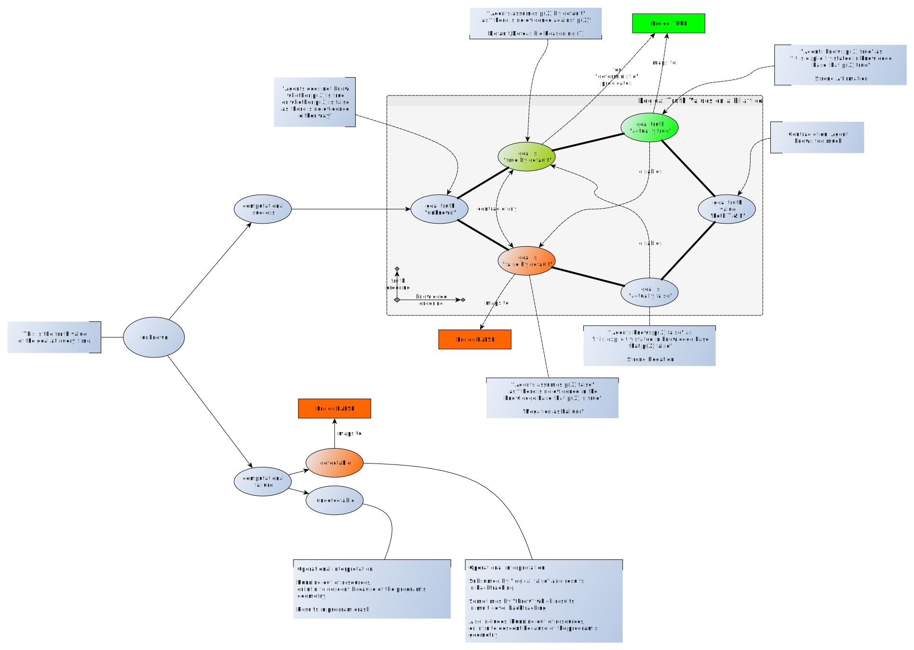

# Truth Values

Once you think about it, you notice that Prolog is both cheating in pretending that it is working in two-valued logic and also deficient in modeling capabilities by keeping to two-valued logic. One day this may be extended! See also: [Paraconsistent Logic](https://plato.stanford.edu/entries/logic-paraconsistent/).

Actually, the tabling implementation provides Well-Founded Semantics (with three truth values) for tables predicates.

- [Well-Founded Semantics](https://www.swi-prolog.org/pldoc/man?section=WFS)
- [`tnot/1`](https://www.swi-prolog.org/pldoc/man?predicate=tnot/1)

