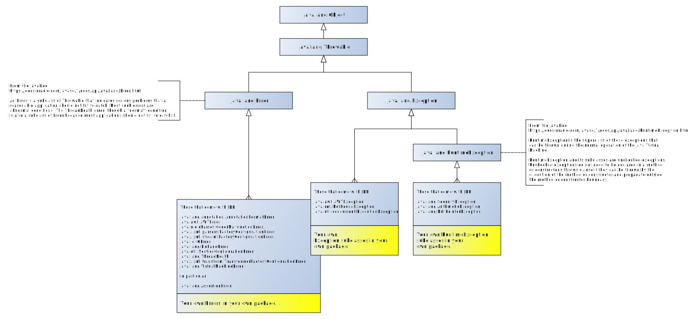

# SWI-Prolog Exceptions

_References to the SWI-Prolog manual pages and more are collected at the tail end of this page._

## Throwing exceptions 

Predicate [`throw/1`](https://www.swi-prolog.org/pldoc/doc_for?object=throw/1) takes a single argument, the _exception term_:

```text
throw(+Exception).
```

User predicates are free to choose the structure of their exception terms (i.e. they can define their own conventions) but _should_
adhere to the ISO-Standard if possible, in particular for libraries.

SWI-Prolog built-in predicates throw exception terms as specified by the ISO standard unless the exception does not fit any of
the ISO standard error term definitions.

In particular [`assertion/1`](https://eu.swi-prolog.org/pldoc/doc_for?object=assertion/1) throws a non ISO standard 
exception term `error(assertion_error(Reason,Culprit),Context)`. 

Another non-ISO standard exception term is thrown by [`dict_pairs/3`](https://eu.swi-prolog.org/pldoc/doc_for?object=dict_pairs/3)
(and probably other dict-handling predicates): `error(duplicate_key(Key),Context)`.

Note that the above exceptions terms use a non-standard formal term but retain the structure of the ISO standard exception term.

## "It actually works"

As the page for [`throw/1`](https://eu.swi-prolog.org/pldoc/doc_for?object=throw/1) says:

> ISO demands that `throw/1` make a copy of `Exception`, walk up the stack to a `catch/3` call, backtrack 
> and try to unify the copy of `Exception` with `Catcher`.

It not only "makes a copy", but "makes a copy that survives backtracking to the catch point" as otherwise
one would never see the values bound to the variables that can be found in the catcher term. It's quite "un-Prolog-y" in fact.

See also: [Salvaging a term out of a dropped search branch](../about_salvaging_a_term_out_of_a_dropped_search_branch)

## Catch with backtrace

[Catch with backtrace](catch_with_backtrace.md)

## Problems with the ISO standard exception terms

[Problems with the ISO standard exception terms](problems_with_the_iso_standard_exception_terms.md)

## Good idea: Collecting exception texts in one place

[Collecting exception texts in one place](throwing_in_style.md)

## Good idea: Selecting whether to "throw or fail" at runtime

Sometimes context determines whether some code, upon encountering an identical
problematic situation, should fail or throw. For example, deterministic predicates
(always succeeding) can only throw to signal a problem (the meaning of which would
then be that a computational problem was encountered, rather a problem in any problem
modeled in logic), whereas semi-deterministic or non-deterministic predicates may choose
to fail instead.

We can add wrappers to throw or fail depending on options list contents.
If `Options` is a list containing the atom `throw`, then throw, else fail:

```
throw_existence_error(Pred,Type,Term,ExCode,Options) :
   (nonvar(Options),memberchk(throw,Options))
   ->
   throw_existence_error(Pred,Type,Term,ExCode)
   ;
   fail. % actually unnecessary to write this, but it's good for the next programmer
```
## Reading

### Coding guidelines say nothing

[Coding Guidelines for Prolog](https://arxiv.org/abs/0911.2899) offers a bit of commentary on _when_ to throw, but does not go further.

### An alternative to Exceptions

[Package 'condition'](https://eu.swi-prolog.org/pack/list?p=condition) provides a _Condition_ system as in Common Lisp. (I haven't tried it yet)
   
### Pages of interest in the SWI-Prolog manual

  - [`library(error)`](https://eu.swi-prolog.org/pldoc/man?section=error) - Has a description of exception meanings & usage
  - [Chapter 4.10: Exception handling](https://eu.swi-prolog.org/pldoc/man?section=exception)
     - [`catch/3`](https://www.swi-prolog.org/pldoc/doc_for?object=catch/3)
     - [`throw/1`](https://www.swi-prolog.org/pldoc/doc_for?object=throw/1)
     - [`catch_with_backtrace/3`](https://eu.swi-prolog.org/pldoc/doc_for?object=catch_with_backtrace/3)
     - [Urgency of exceptions](https://eu.swi-prolog.org/pldoc/man?section=urgentexceptions)
     - [Debugging and exceptions](https://eu.swi-prolog.org/pldoc/man?section=debugexceptions)
     - [The exception term](https://eu.swi-prolog.org/pldoc/man?section=exceptterm)
  - [B.6 Hooks using the exception predicate](https://eu.swi-prolog.org/pldoc/man?section=exception3)
  - [A.14 library(debug): Print debug messages and test assertions](https://eu.swi-prolog.org/pldoc/man?section=debug)
     - [assertion/1](https://eu.swi-prolog.org/pldoc/doc_for?object=assertion/1)
  - Code which translates exception terms to cleartext messages (generally on the Prolog Toplevel), via DCG:  
     - [`term_message//1`](https://www.swi-prolog.org/pldoc/doc/_SWI_/boot/messages.pl?show=src#term_message//1).
     - This is file `${DISTRO}/lib/swipl/boot/messages.pl`
     - See also this report about `jpl.pl` by Jan Burse: [Issue#59](https://github.com/SWI-Prolog/packages-jpl/issues/59)
  - [Printing messages](https://eu.swi-prolog.org/pldoc/man?section=printmsg) from exceptions, but can be used more generally. See 
    also Anne Ogborn's [Tutorial](http://www.pathwayslms.com/swipltuts/message/index.html) on printing messages
     
## Compare with

### From the Java World: The Exception Hierarchy




